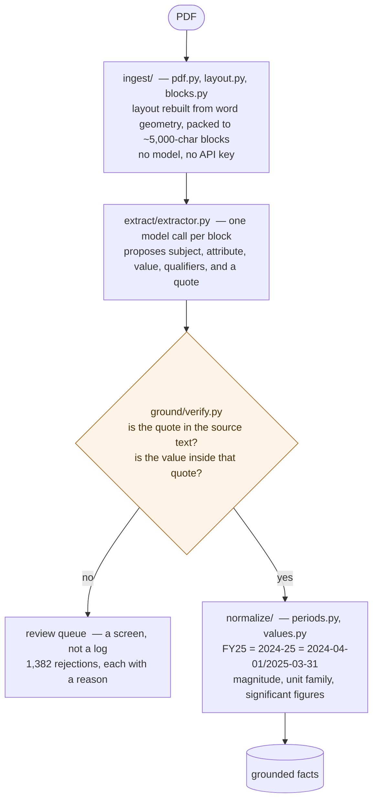
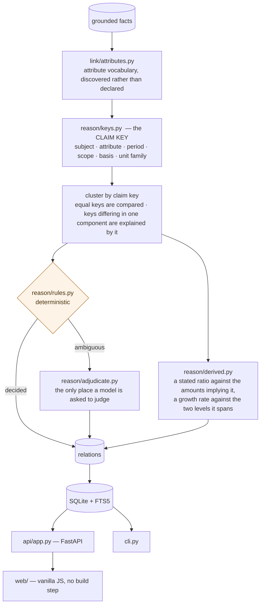

# CrossCheck — a fact knowledge layer

Extracts facts from PDFs, links every fact to verified evidence in its source document, and
explains when facts corroborate, contradict, or only *appear* to conflict.

Upload a PDF through the UI or the API and the whole layer runs against it: layout
reconstruction, extraction, grounding, vocabulary consolidation, then reconciliation against
everything already known. Nothing is specific to the starter documents — no hard-coded facts,
filenames, schemas or per-document rules.

**[Setup and run](#setup-and-run-instructions)** ·
**[Video demo](#video-demo)** ·
**[Architecture](#architecture)** ·
**[Approach](#approach)** ·
**[Trade-offs](#engineering-decisions-and-trade-offs)** ·
**[The four required cases](#the-four-required-cases)** ·
**[Limitations and next steps](#limitations-and-next-steps)** ·
**[Additional notes](#additional-notes)**

---

## Architecture

The pipeline has two halves, and the split is the design. The first half exists to produce
facts that can be *trusted*; the second compares them. Almost all the difficulty is in the
first half — comparison is easy once two facts are known to be about the same thing.

### One: from a PDF to a fact that survived checking



### Two: from facts to relations between them



Three things in those pictures carry most of the design.

**The check after extraction is a gate, not a log.** A proposed fact whose quote is not in the
source, or whose number is not inside its own quote, never becomes a fact. It goes to the
review queue — which is a screen in the product, because those failures are the evidence
about how well extraction is actually working.

**Everything before `reason/` exists to make the claim key trustworthy.** Period normalisation
and unit families are not housekeeping; they *are* the comparison. Getting a period wrong
invents contradictions between sources that agree, and hides the real ones.

**Rules run first and the model is the fallback**, not the other way round. Periods, units and
arithmetic are settled deterministically and carry a rule label; the model is asked only where
rules genuinely cannot decide, and every relation records which decided it.

*Approach*, below, takes each of these apart with the evidence that led to it.

---

## Setup and run instructions

Requires Python 3.11+.

```bash
git clone <this repo> && cd crosscheck
python -m venv .venv && . .venv/bin/activate      # Windows: .venv\Scripts\activate
pip install -r requirements.txt
cp .env.example .env                              # then add an API key
```

Put a key in `.env`. Two roles are configured separately — see *Approach* for why:

```
# Extraction: the best-measured option, and free.
CROSSCHECK_EXTRACT_PROVIDER=openai
CROSSCHECK_EXTRACT_BASE_URL=https://api.cerebras.ai/v1
CROSSCHECK_EXTRACT_API_KEY=csk-...
CROSSCHECK_EXTRACT_MODEL=gpt-oss-120b
CROSSCHECK_EXTRACT_REASONING_EFFORT=low   # required: at its default the model spends
                                          # its whole output budget on reasoning

# Reconciliation: a few hundred calls where judgement decides the output.
CROSSCHECK_REASON_PROVIDER=openai
CROSSCHECK_REASON_BASE_URL=https://api.openai.com/v1
CROSSCHECK_REASON_API_KEY=sk-...
CROSSCHECK_REASON_MODEL=gpt-4.1-mini
```

Extraction models were chosen by measurement, on an identical 30-block sample from this
corpus, not by reputation or price:

| Model | Grounded | Wide-table decomposition |
|---|---|---|
| **`gpt-oss-120b`** (Cerebras, free) | **429/429 — 100%** | correct: one fact per cell, right period on each |
| `gpt-5-nano` (OpenAI, ~$0.50/corpus) | 338/401 — 84% | copies whole rows back as one value |
| `gpt-4o-mini` | 66–90% | failed to read the corpus's central table at all |
| `gpt-4.1-mini` | 53% | truncated `₹2,076 Cr` to `76 Cr` |

Cerebras' free tier allows 1M tokens/day but only 150 requests/hour, so a full ~700-block
corpus spans more than one day; the content-addressed cache makes resuming free.
`.env.example` documents all three options with the trade-offs.

Start the server:

```bash
python -m uvicorn crosscheck.api.app:app --port 8077
```

Open <http://localhost:8077> and drop in a PDF.

### Or from the command line

```bash
python -m crosscheck.cli ingest "starter-datasets/delhivery/*.pdf"
python -m crosscheck.cli extract          # all documents
python -m crosscheck.cli link             # consolidate the attribute vocabulary
python -m crosscheck.cli reconcile        # find relationships

python -m crosscheck.cli relations --type CONTRADICTS
python -m crosscheck.cli facts --query "revenue"
python -m crosscheck.cli evidence 42      # render a fact's evidence on its page
python -m crosscheck.cli review           # what the system refused to believe
python -m crosscheck.cli schema           # the discovered attribute vocabulary
```

`link` and `reconcile` accept `--no-llm` to run on rules alone, with no API calls at all.
Tests need no key: `python -m pytest -q`.

Nothing is committed that holds a credential; `.env` is gitignored.

---

## Video demo

A three-minute walkthrough: a PDF going in, a fact traced back to the highlighted words that
support it, and each of the four required cases.

https://github.com/user-attachments/assets/674eedb4-2c30-43ce-8802-2e715dad160f

*(Renders as a player on GitHub. If you are reading this file outside GitHub, open the link
directly.)*

---

## Approach

### The problem is comparison, not extraction

Pulling numbers out of a PDF is the easy half. The hard half is that **two numbers are only
comparable once you agree what claim each is making.** ₹8,142 Cr and ₹2,076 Cr look like a
flat contradiction until you notice one is a year and the other its fourth quarter.

So the system is built on one object, the **claim key**:

```
(subject, attribute, period, scope, basis, unit_family)
```

| Claim keys | Values | Relation |
|---|---|---|
| identical | agree | **CORROBORATES** |
| identical | disagree | **CONTRADICTS**, or **SUPERSEDES** if a later document revised an earlier estimate |
| differ in one component | disagree | **RECONCILED_BY_CONTEXT** — and the differing component *is* the explanation |

Case 3 falls out of the data model rather than needing special handling. This is also why the
extraction prompt is built around one rule: **qualifiers never go in the attribute name.** An
attribute of `"FY24 consolidated revenue in crore"` can only ever match itself.

Keys are built from the *interval* a period denotes, never its label, so the Economic
Survey's `FY25`, the RBI's `2024-25` and the IMF's `FY2024/25` collide as one claim. Getting
this wrong invents contradictions between sources that agree and hides the real ones.

### Grounding is verified, not asserted

A model saying "page 12 states X" is not evidence. Every proposed fact must survive two
checks against the exact text the model was shown:

1. its quote must be **found in the source**, verbatim or by high-threshold fuzzy alignment;
2. its **value must appear inside that quote**.

The second check is the one that earns its keep: it catches a genuine quote paired with a
number lifted from a neighbouring table row — a failure that is indistinguishable from a real
fact afterwards. Anything that fails lands in a **review queue** with a reason rather than in
a log, because those failures are evidence about the extractor and belong in the product.

Verified evidence is then located on the page and rendered with a highlight. Prose is matched
by token sequence; a table row cannot be, because the quote is a row *this system
synthesised*, so the row label is found and the value located within its band.

### Layout is reconstructed from geometry

PyMuPDF's own structure extraction was silently wrong on this corpus in ways that produce
confident, evidence-backed, false facts. The RBI report yields one block per *line* in two
columns, so naive blocking gives fragments like `"headline inflation"` / `"eased by 73 bps to
4.6 per cent"`. `find_tables` shreds borderless financial tables into `"Real GDP (a"` |
`"t market price"` | `")"` with values offset from their headers.

So layout is rebuilt from word boxes. The key observation is that **financial tables are
decimal-aligned**: the x-centres of numeric tokens cluster tightly even when no ruling line
exists and the row labels are ragged. Columns come from those clusters, and every value is
emitted bound to its own header:

```
Real GDP (at market prices): 2021/22=9.7; 2022/23=7.6; 2023/24=9.2; 2024/25=6.5
```

Slides are treated as a separate medium: rows are split at wide gaps and clustered by
x-centre, so each figure stays with its own caption instead of arriving on one line with the
captions on the next.

### Rules decide, the model explains

The claim key does the hard part, so the reconciliation rules are small and deterministic.
The model is asked only for what rules genuinely cannot settle — chiefly whether a
disagreement is a contradiction or a later vintage revising an earlier estimate, which means
reading what each source claims about firmness. **Every relation records whether a rule or the
model decided it**, so the reasoning is auditable rather than a black box.

A **derived-value checker** finds corroboration between facts that are not the same claim at
all: a stated margin against the amounts that imply it, a stated growth rate against the two
levels it spans. No formula is hard-coded; it looks for arithmetic that holds among facts
sharing a subject and period, and requires the attribute names to overlap before believing
it. Without that guard it is numerology — among a few dozen figures sharing a period, some
pair divides into some percentage by chance.

### The schema evolves

The attribute vocabulary is a table, not an enum. It starts empty and grows as documents
introduce measures nobody anticipated. Fuzzy grouping does the free work and pins each group
to a unit family; the model names the groups and splits any that should not have merged. The
dangerous merge is a level with a rate of change — `revenue` with `revenue growth`, `EBITDA`
with `EBITDA margin` — because the strings look nearly identical and the claims are
unrelated, so the prompt is built around refusing it.

### Engineering decisions and trade-offs

- **SQLite, not a graph database.** Relations are rows. The assignment is explicit that a
  graph is not the contribution, and this keeps setup to one `pip install`.
- **Two model roles, configured separately.** Extraction is ~700 high-volume, low-judgement
  calls where a free tier is right and the grounding gate catches what a weaker model gets
  wrong. Reconciliation is a few hundred calls where judgement decides the output.
- **Rules over prose.** A rule-decided relation gets its explanation written from the recorded
  facts, not by a model: the rule already knows why it decided, so paying for prose would add
  cost and a chance to be wrong.
- **Refusing to represent what cannot be represented honestly.** Tables whose columns cannot
  be named, or whose cells hold two numbers, are dropped back to prose. A number that is real
  with a binding that is invented is the worst failure mode — it grounds perfectly and means
  nothing.
- **No embedding model.** Blocking uses fuzzy string similarity plus LLM canonicalisation
  rather than a 200 MB torch install. Cheaper to run and to install; costs some recall on
  attributes that share no words.
- **Facts are per-document assertions, never merged into a single truth.** The system reports
  who claims what and how the claims relate. It does not adjudicate reality, which is the
  honest behaviour when institutional sources disagree.

### Performance and incrementality

- **Caching is content-addressed** on block text + prompt version + model, so re-ingesting a
  document, adding one, or resuming an interrupted run costs nothing for work already done.
- **Blocks are packed** to ~5,000 characters, which cut the corpus from 15,334 extraction
  units to ~660 while giving each call more of the context a number needs.
- **Linking is incremental**: a new document is compared against the clusters its facts join,
  not against the whole corpus, and only genuinely new attributes reach the vocabulary pass.
- **A sliding-window token bucket** paces requests under the provider's limit. Free tiers
  meter tokens, not requests, and discovering that by hitting 429s wastes most of the budget:
  reserving before sending took measured throughput from 0.6 to 2.6 blocks per minute on the
  same account.

### AI tools used

Claude Code (Opus 5 and Sonnet 5, across the session) for implementation throughout,
including writing this document. Model choice for the pipeline itself was settled by
measurement, not assumption: an A/B harness (kept in the session's working notes, not
committed — it was a disposable script, not part of the product) compared candidate
extraction models on the same real blocks from this corpus before committing to one, and
that pilot is what found `gpt-4.1-mini` and `gpt-4o-mini` both silently truncating and
misreading the corpus's central table, and `gpt-5-nano` returning nothing at all until
`reasoning_effort` was set explicitly.

---

## The four required cases

Every example here is real output from the committed run — no hand-picked data, no hard-coded
rule, nothing staged. `docs/four-cases.md` has the full write-up with evidence quotes and page
numbers; each case is reproducible against `samples/crosscheck.sample.db` without an API key.

### 1 · Corroboration

Three facts from the Q4 FY24 deck that are **not the same claim as each other**, so key
matching alone finds nothing:

| | Value | Attribute |
|---|---|---|
| A | `46` Cr | `ebitda` |
| B | `2,076` Cr | `revenue from customers` |
| Target | `2.2%` | `ebitda margin` |

`46 ÷ 2,076 = 2.22%`, matching the stated 2.2% — relation `#4212`, **decided by rule, no
model call**. No formula for "EBITDA margin" is hard-coded; `reason/derived.py` looks for any
stated percentage that equals one same-subject, same-period amount over another, guarded so it
does not become numerology (see case 4d). The cross-document variant works the same way:
FY23 `₹7,224 Cr` and FY24 `₹8,142 Cr` from the deck against the annual report's separate
"YoY: 12.7%" — `(8,142 − 7,224) ÷ 7,224 = 12.7%`, exact.

```bash
python -m crosscheck.cli relations --type DERIVED_CONSISTENT --query "2,076" --limit 1
```

### 2 · A genuine contradiction — and the system currently gets it wrong

Real GDP growth, India, FY2024-25 — identical subject, attribute and fiscal-year interval:

| Source | Value |
|---|---|
| IMF, *2025 Article IV* — fact `#50` | **6.5%** |
| *Economic Survey 2024-25* — fact `#4020` | **6.4%**, called a first advance estimate |

A real 0.1-point disagreement on the same measure for the same period. **The system labels it
`RECONCILED_BY_CONTEXT` instead**, because the extractor tagged the Survey fact
`scope: consolidated` — a corporate-accounting term that means nothing for a national growth
figure. One spurious claim-key component was enough for a rule to explain away a real
difference, and to stop the pair ever reaching the model that should have judged it. That is
reported here rather than hidden, and it is itself an instance of case 4.

### 3 · An apparent contradiction, explained by context

FY24 revenue from services `₹8,142 Cr` (fact `#1048`) against Q4 FY24 revenue from services
`₹2,076 Cr` (fact `#1085`) — same subject, same attribute, a four-fold gap.

`normalize/periods.py` resolves both labels to real date intervals and finds the second
**contained within** the first. Exactly one claim-key component differs, so the pair is
`RECONCILED_BY_CONTEXT` with discriminator *"period (one covers part of the other)"* —
relation `#661`, **decided by rule**, zero model calls. An annual figure and its own fourth
quarter are not a contradiction; containment is what that looks like.

```bash
python -m crosscheck.cli relations --type RECONCILED_BY_CONTEXT --query "against Q4 FY2023-24" --limit 1
```

### 4 · Failures found by running it, and what was done about them

Eight distinct issues surfaced by auditing the pipeline's own output. **Five fixed with
tests, three documented honestly.**

| | Failure | Outcome |
|---|---|---|
| 4a | A whole table row copied into one value — *invisible to grounding*, since the string is genuinely verbatim, and `values.py` then reads the year `2021` as the number | **Fixed** twice: a validation guard, then the cause removed by measuring a better extractor — table grounding 59% → 99.3%, 845 → 2,760 table facts |
| 4b | Value truncated mid-phrase (`"5.6 percent of"`) | **Fixed** — dangling-word check |
| 4c | `token_set_ratio` silently merged `revenue` with `percentage of revenue` across the whole vocabulary | **Fixed** — the most consequential bug found |
| 4d | Numerology in the derived-value checker (`exercise price ÷ deposit balance ≈ volatility`) | **Fixed** — the target must name itself as a ratio |
| 4e | Reconciliation re-paying for adjudications it had already made | **Fixed** — UNRELATED verdicts stored too |
| 4f | Directors' biographies collapse under `subject: Delhivery Limited`, because the block with *"He holds a bachelor's degree…"* lost the sentence naming him. **Every `CONTRADICTS` relation currently stored is a false positive of this shape** | **Found, not fixed** — needs wider blocks or a coreference pass, not a one-line guard |
| 4g | Chart axis labels read linearly into one scrambled but genuine string | **Found, not fixed** — provably inert: no number parses, so `value_num` stays `None` |

The **Review** screen is where this work happened: 1,382 rejections, grouped by what actually
went wrong — 811 quotes not in the source, 341 quotes that were real but whose number was not
inside them, 109 short quotes not found verbatim. That second row is the dangerous class, and
it is why the grounding gate checks the value separately from the quote.

```bash
python -m crosscheck.cli review
```

---

## Limitations and next steps

Everything in this section was found by running the pipeline against the real corpus and
reading its actual output — not by imagining failure modes in the abstract. The full
write-up, with real fact IDs and evidence, is `docs/four-cases.md`; this is the summary.

**Fixed this session, with tests** (`docs/four-cases.md` cases 4a–4e for detail):
- table rows the extractor copied whole instead of decomposing per cell;
- values truncated mid-phrase;
- a fuzzy-matching bug that silently merged a level with a ratio built out of it, and one
  sector's growth rate with a different sector's — the most consequential bug found, since it
  corrupted the vocabulary every later comparison depends on;
- numerology in the derived-value checker (a coincidental ratio match against an unrelated,
  correctly-named denominator);
- reconciliation re-paying to ask the model about a pair it had already adjudicated.

**Known, unfixed limitations:**
- **Subject disambiguation across paragraph boundaries fails for biographical facts.**
  A director's education, appointment date and remuneration are extracted with `subject:
  Delhivery Limited` rather than the director's own name, because the block containing "He
  holds a bachelor's degree…" does not carry the earlier sentence naming who "He" is. Every
  `CONTRADICTS` relation this system currently stores turns out to share this root cause —
  different directors' different, non-conflicting biographical facts, not a genuine
  contradiction. This is why case 2 in `docs/four-cases.md` is built from a macro-economic
  pair (`India` as subject, well disambiguated across all three documents) rather than from
  the system's own top-confidence `CONTRADICTS` list. A real fix needs either wider block
  context around named-entity introductions or a lightweight coreference pass before
  extraction — real engineering, which is why it is reported here rather than patched under
  a guard.
- **Chart and figure text is extracted as if it were prose.** A chart's axis labels and
  caption, read in PDF layout order, interleave into a scrambled but genuine string that
  grounds perfectly and means nothing. Harmless downstream — it never parses to a number, so
  it never enters a comparison — but it pollutes the Facts screen. A real fix means detecting
  chart/figure regions during layout reconstruction.
- **`"share"` is ambiguous between a proportion and an equity share.** The derived-value
  checker's ratio-signal guard (`docs/four-cases.md`, case 4d) treats "share" as marking a
  ratio, so a level like "post-offer paid up share capital" occasionally still gets tried as a
  ratio target. A genuine fix needs the target to be checked against the actual arithmetic
  more strictly, or a small allowlist/denylist refinement — deferred given the two other,
  unrelated-denominator false positives this same guard does correctly eliminate.
- **Two blocks out of 696 (0.3%) returned an empty response** from the extraction model with
  no further detail available from the API to diagnose why. Landed in the review queue rather
  than silently vanishing, but not individually investigated.
- **Document metadata extraction is incomplete for two of the six documents** — the FY24
  annual report's publication date and the Economic Survey's publisher were not confidently
  identified from their opening pages and are stored as unknown rather than guessed. This
  only affects display and `SUPERSEDES` ordering (an undated document sorts last, so it is
  never treated as the earlier one) — never comparison correctness.

**What I would build next**, roughly in priority order: the two unfixed limitations above;
a Findings-screen category for case-4-shaped near-misses (facts that grounded but tripped a
quality guard), currently visible only via the CLI's `review` command; and the four
brownie-point extensions the design already supports but this session did not get to
exercise end-to-end at scale — many-document performance beyond six, and a live demonstration
of incremental re-ingest (add a seventh document to an already-reconciled corpus and confirm
only its facts get compared, at near-zero added cost thanks to the idempotency fix in
`reason/adjudicate.py`).

---

## Additional notes

**Cost.** The full six-document corpus — 696 extraction blocks, 7,750 grounded facts,
3,618 canonical attributes, 4,579 relations — cost roughly **$2.25** in API spend, and would
cost far less to reproduce. Extraction of all 193 table blocks (the hard part, and the bulk
of the facts) ran on Cerebras' free tier at **$0.00**; the paid spend is prose extraction
(`gpt-5-nano`, ~$0.46), vocabulary consolidation and reconciliation (`gpt-4.1-mini`), plus
the pilots that chose those models and the re-runs after each correctness fix described
above. Extracting the whole corpus on Cerebras rather than just its tables would bring
extraction to zero, at the cost of spanning more than one day against its 1M token/day cap.

**On finding bugs by running the system, not just by writing it.** Several of the fixes in
`docs/four-cases.md` were found by treating the pipeline's own output as something to audit,
not just something to ship once it ran without erroring — reading the actual `DERIVED_CONSISTENT`
relations turned up numerology a code review would not have caught, and reading the actual
`CONTRADICTS` list turned up the subject-disambiguation failure. That process is itself part
of the submission: `docs/four-cases.md` case 4 is not four contrived examples, it is what
was actually found.

**The run behind these numbers is committed, not just described.** `samples/crosscheck.sample.db`
is the actual populated database — 7,750 grounded facts, 3,618 canonical attributes, 4,579
relations — from the run that produced this submission. `cp samples/crosscheck.sample.db
data/crosscheck.db` and the UI or CLI shows real output with no API key and no wait; see
`samples/README.md`. `docs/four-cases.md`'s fact and relation IDs are from this same file, so
its examples are directly reproducible against it. A fresh `crosscheck ingest && extract &&
link && reconcile` against `starter-datasets/` with the same models will reproduce equivalent
facts, though exact relation and attribute IDs may differ depending on call ordering under
concurrency.
